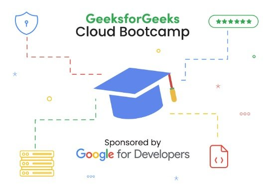

`        ` 

**Join the live session:
👉 https://practice.geeksforgeeks.org/batch/cloud-bootcamp?tab=Live 👈**

**Course Description**

Are you looking to build a successful career in cloud computing with a focus on **Google Cloud Platform**? This comprehensive Bootcamp is specifically designed to prepare you for becoming a Cloud Engineer and help you gain the proficiency to leverage GCP's powerful infrastructure.

**Course Overview
Cloud computing** has transformed the IT landscape, revolutionizing the way organizations build and deploy applications, store and analyze data, and streamline business operations. It offers unparalleled scalability, flexibility, and cost-effectiveness, making it an essential skill for professionals across various industries. **It opens doors to exciting career opportunities in fields such as Software Development, Data Science, Cybersecurity, and IT infrastructure management**.

Whether you are a budding IT professional or a cloud enthusiast, this boot camp will provide you with the necessary knowledge and skills to thrive in the cloud computing industry. From the foundational aspects of Cloud computing to gradually building upon them more advanced optimization concepts, this boot camp is designed to ensure a blend of theoretical understanding and practical implementation, making you industry-ready.

**Key Highlights:**
Enhanced Cloud Knowledge
Industry-Recognized Credential
Practical Skills Development
Understanding Cloud Transformation
Hands-on Practice and Assessments
Live sessions
Doubt Clearing Support
Study Material
Hands-On Labs	

**Ultimate Outcome:**
Enhanced Cloud Knowledge
Continued Professional Growth
Expanded Career Opportunities
Improved Project Success
Networking and Collaboration Opportunities

**What you will learn**

- Acquire a foundational understanding of cloud computing, including its basics and benefits. 

- Students will be introduced to the Google Cloud Platform (GCP), gaining familiarity with its core products and services. 

- Students will learn core infrastructure components in GCP, including compute options, storage options, networking, and identity and access management (IAM).

- Students will dive into the business aspects of cloud computing, understanding its impact on organizations. 

- Students will learn how to deploy various Google Cloud solutions, the process of automating infrastructure, deploying applications, and implementing effective deployment strategies.

- Monitoring, Management, and Security in Google Cloud and Troubleshooting and Performance Optimization would be understood by them.

- The program provides practical hands-on labs using GCP services, allowing students to gain real-world experience and apply their knowledge.
Additionally, the boot camp offers additional features such as live sessions, doubt support, study material, and hands-on labs to enhance the learning experience and provide comprehensive support to students.

